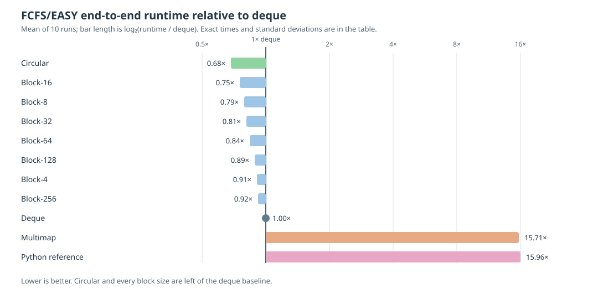

# Wait Queues

The FCFS scheduler can use `circular`, `deque`, `multimap`, or `block` wait
queues. The default is **`circular`**. This section collects the implementation
guides, testing instructions, and the evidence behind that default in one
place.

## Default queue and selection

Use the default **`circular`** queue for FCFS workloads unless a workload-specific
benchmark says otherwise:

```bash
${CMAKE_INSTALL_PREFIX}/bin/simulator trace.csv --priority_policy fcfs
```

`deque` remains the simplest fallback. The `block` and `multimap` queues remain available
for comparison, testing, and research.

## Benchmark record

This record was collected in October 2026 using
[`tests/test_traces/scale/huge_10000jobs.csv`](https://github.com/LLNL/dr_evt/blob/main/tests/test_traces/scale/huge_10000jobs.csv)
(10,001 jobs), 500 nodes, and
FCFS with EASY backfilling on an Intel Sapphire Rapids node (112 cores,
256 GB memory). Values are the mean of 10 end-to-end runs; `±` is the
population standard deviation.

**Benchmark script:** [`tests/benchmark_block_sizes.sh`](../../tests/benchmark_block_sizes.sh)

The timing includes trace parsing, scheduling and backfilling, event handling,
and trace output. It is not an isolated wait-queue microbenchmark. The queue
implementation is the intended variable, but the complete difference cannot be
attributed solely to queue operations.

For sampled hot-path measurements within the circular FCFS scheduler, see
[Performance Analysis](PERFORMANCE_ANALYSIS.md). That profile complements this
end-to-end queue comparison; the two measurements use different workloads and
should not be compared numerically.



| Implementation | Time (s) | vs deque | Change | Peak queue | Correctness |
| --- | ---: | ---: | ---: | ---: | --- |
| `deque` | 0.4735 ± 0.0173 | 1.00× | baseline | 8,904 | baseline |
| `multimap` | 7.4367 ± 0.0420 | 15.71× | +1,471% | 8,904 | PASS |
| **`circular`** | **0.3238 ± 0.0035** | **0.68×** | **−32%** | **8,904** | **PASS** |
| Python reference | 7.5574 ± 0.0124 | 15.96× | +1,496% | N/A | PASS |
| `block`-4 | 0.4293 ± 0.0022 | 0.91× | −9% | 8,904 | PASS |
| `block`-8 | 0.3753 ± 0.0005 | 0.79× | −21% | 8,904 | PASS |
| `block`-16 | 0.3570 ± 0.0006 | 0.75× | −25% | 8,904 | PASS |
| `block`-32 | 0.3837 ± 0.0014 | 0.81× | −19% | 8,904 | PASS |
| `block`-64 | 0.3978 ± 0.0022 | 0.84× | −16% | 8,904 | PASS |
| `block`-128 | 0.4197 ± 0.0021 | 0.89× | −11% | 8,904 | PASS |
| `block`-256 | 0.4350 ± 0.0036 | 0.92× | −8% | 8,904 | PASS |

`circular` was fastest overall, and `block`-16 was the fastest block size.

The 10 runs produced identical simulated-job output across every measured C++
queue variant, including `multimap`. The Python reference is an end-to-end
baseline. Its CSV schema is normalized before its job order and start/end times
are compared with the C++ `deque` schedule using a `0.001` tolerance.

Run the same benchmark with:

```bash
tests/benchmark_block_sizes.sh
```

The script tests `deque`, `multimap`, `circular`, every supported `block` size,
and the Python reference. It byte-compares the C++ queue outputs with `deque`
and compares the normalized Python schedule with `deque` within `0.001`.

The unit and differential coverage is listed under
[Wait-queue tests](https://github.com/LLNL/dr_evt/blob/main/tests/README.md#wait-queue-tests).

## Queue guides

```{toctree}
:maxdepth: 2

BLOCK_WAIT_QUEUE
OUTPUT_TRACE_BUFFERS
```
